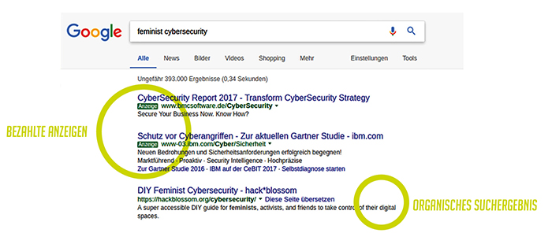
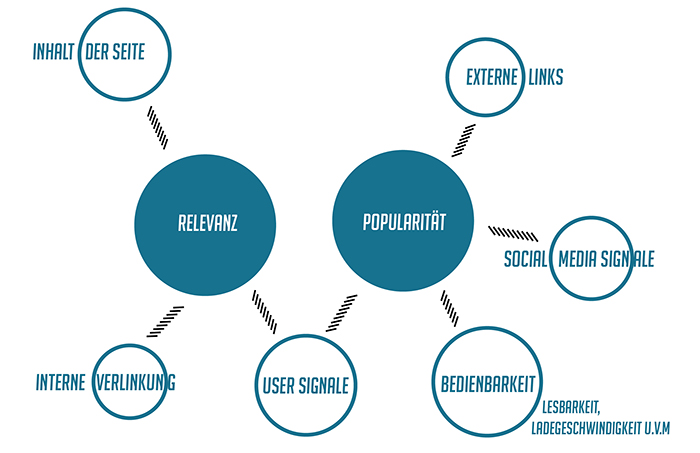
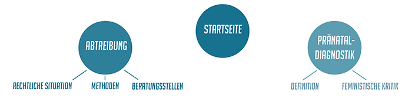
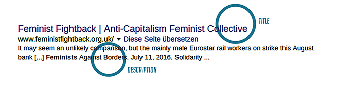
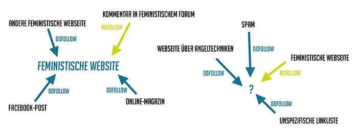

Google has become the go-to for all types of information and when we search (or "google") something, we usually click on the first, second or third result. Google's search engine logic is therefore critical to what content we read (and don't read).

How can leftist and feminist organizations move to the top of search results, and thereby reach a larger audience?

Feministclickback.org aims to answer this question by providing information about Search Engine Optimization (SEO) and a step-by-step guide for implementing it for your site.

<h2>Intended audience</h2>

This guide is primarily – but not exclusively – intended for:

<ol>

<li>Activists who want to start a new website and use SEO</li>
<li>Activists who want to reach a wider audience by adding SEO to an existing site.</li>
</ol>

[[&nbsp;In the original German text we use a * while writing about gender to indicate that we are referring not only men or women, but also people with a gender identity that does not fit neatly within the gender binary. In the English translation that shouldn't necessarily apply, but if you have feedback or questions about the terms and language we use, we would love to hear from you.&nbsp;]]

<h2 id="inhalt">Table of Contents</h2>

<ul>
<li><a href="#idee">Concept  Why is SEO important for Feminists?</a></li>
<li><a href="#technischer-hintergrund">Technical background How do search engines work?</a></li>
<li><a href="#politischer-hintergrund">Political context  Google & Feminism</a></li>
<li><a href="#how-to">How to Step-by-step guide</a></li>
</ul>

<h2 id="inhalt">How to use this guide</h2>

No prior SEO knowledge is necessary to use this guide, however some previous skills in building and maintaining your own website will be helpful. All websites use different tools and frameworks (e.g., Wordpress) and it isn't in the scope of this guide to include information on all website technologies. If you ever get stuck, try searching for specific terms in relation to your Content Management System (CMS).

If you really want to get the most out of SEO it's important to understand how it works. Although it seems cumbersome, understanding the "Technical Background" section will be vitally important for your ability to make decisions and understand later sections. To help develop your SEO strategy, the "Political Context" section provides information about how Google handles feminist-related terms and how anti-feminist sites use SEO. This section also includes tips for those with an existing site.

Finally, there is a <a href="/en/glossary/">Glossary</a> of the most important terms. Terms from the Glossary are referred to in this guide with a ‣.

<strong>NOTE: </strong>Prominence in search results has a lot of advantages but can also bring problems. If a group is more visible, it is also more easily attacked. Please keep that in mind while using this guide. Resources about security and hate speech on the web:

  <ul>
    <li><a href="https://hackblossom.org/cybersecurity/">DIY Guide to Feminist Cybersecurity [english]</a></li>
    <li><a href="https://onlinesafety.feministfrequency.com">Manual „Speak up and Stay Safe(r)“ by Feminist Frequency [english, spanish, arabic]</a></li>
  </ul>

<h2 id="idee">Concept</h2>

There are two kinds of Google search results: paid advertisements are marked with a small label at the top and underneath begin the so called ‣organic search results. These aren‘t paid and Google sorts them according to their relevance.

/

[[&nbsp;Paid ads could also be useful in some circumstances for political campaigns. Price depends on the popularity of the search term and how long the ad is up.&nbsp;]]

Search Engine Optimization (SEO) is the attempt to build a website so that it appears as high up as possible in the ‣organic search results.

Many leftist and feminist projects setup websites in order to make their information and activities more accessible to a wider audience, which furthers their goals of education, publishing reports or simply being a contact point. These websites often have incredible amounts of useful information in them and take lots of energy to produce, but when it comes to spreading this information, groups don‘t know about or don't use all the possibilities available to them. A website link is often posted on flyers or spread through social media, which often only reaches those who already know the project or are already connected in some way to that specific scene.

SEO offers the opportunity to reach an entirely different audience in addition to existing social circles. For many, Google is their entry point to the internet and the first place they look for information. Very few people click past the first page of results and that means that the results on the third, fourth or fifth page have almost no chance of being clicked. Around 30% click on the first result, 15% on the second result, and after that the percentages sink dramatically (see <a href="https://www.advancedwebranking.com/cloud/ctrstudy/">Google CTR-Studie</a>).

What's more, many right-wing and anti-feminist sites use SEO in the building and structure of their sites to spread their messages. Feminist and leftist sites are doing comparably poorly: A google search for „Abortion“ yields more results for the "Right-to-life" movement than for health or feminist organizations. When you search the terms <a href="https://de.wikipedia.org/wiki/Gender-Mainstreaming">"Gender Mainstreaming"</a> or <a href="iehe FAQ der Unterstützer_innengruppe DEFMA und Beitrag von Antje Schrupp">"Definitionsmacht"</a>, you quickly find the „wikiMANNia“ site, a German right-wing anti-feminist site that is extremely well-ranked for many relevant search terms.

The internet is a fought-for place and it‘s important that leftists join the fight and use all potential tools.

From leftist and feminist perspctives, we must continue to critique the huge search engine companies in the capitalist market like Google and Bing. In that sense, it‘s important and understandable that people move away from using Google & Co. The scope of this guide, however, is not whether or not leftists can or should use Google – but how leftists can use Google to reach people who are not yet politized.

Google has a 90% market share in Germany and 88% worldwide (see <a href="https://www.luna-park.de/blog/9907-suchmaschinen-marktanteile-weltweit-2014/">Study from 2014 [german]</a>). As long as the majority of people use Google, it woulnd‘t make sense to completely dismiss SEO as a strategy. This guide therefore doesn't critique Google, it simply offers a way to reach people on the internet where they already are.

<h2 id="technischer-hintergrund">TECHNICAL BACKGROUND</h2>
<h3>How do Search Engines work?</h3>

Search Engines first have to know which websites exist in order to show relevant search results. To figure this out, search engines use special programs called ‣bots to continuously search the web and find sites. The process is called ‣crawling. These ‣bots are also sometimes called "spiders".

The ‣bots crawl endlessly through the internet by following links that bring them to the next site. Sites they find relevant end up in a database. As soon as the ‣bots find a site, they decipher the ‣source code, try to understand the content, and decide which are the related search terms. This process is called ‣indexing (cataloging) and the database is called the ‣index. These databases are huge (over 100 million GB) and are saved all over the world in computing centers. Search engines can manage to give an answer to a search term in just a few milliseconds due to the fact that these ‣index databases have already pre-sorted the internet.

Relevance and popularity are the most important ‣ranking factors that decide whether a site is ranked first, second, third, etc. The search engines try to understand not only whether the results are ‣relevant to the search term, but also how users behave on that site. They evaluate ‣user signals to see whether or not users found the information they were looking for (‣popularity).

<h2>Search engines in detail</h2>

So how is it possible to design a website so that it‘s relevant for certain search terms?

‣Ranking factors are extremely complex – today Google uses over a hundred different ones. Unfortunately Google does not publish which ones it uses because it would hinder their competitiveness in the market.

Nonetheless, there are a few proven strategies whose theories are covered in the following four sections. This background information is vital to understanding the practical "How to" section, which can be found in the last section.

<h3>1. Websites from a Search Engine‘s Perspective</h3>

Search engines see websites differently than people do. If a search engine‘s ‣crawler comes across a website, it follows the site‘s links and deciphers the ‣source code in order to understand the site as a whole.

The structure of a website is therefore quite important because the search engine results are ordered using the base ‣URL. For example, say someone searches the term „Feminist movement“, and the same website has five different pages related to this topic. If the contents of the five different pages are too similar to one another, the search engine will not be able to differentiate between them and in the end doesn‘t choose any of them. This is called ‣duplicate content in SEO jargon.

To avoid this, each sublink should have its own clear topic. A tree structure can be quite helpful in this regard: a main site has links to its main topics and from there are links to sites with more detailed information:

It is much easier for a search engine to understand a website‘s content if it uses this tree structure. The most important sub-pages should have links in the main navigation. Links to any sub-themes should only be on the sites that relate to their main themes and only on pages where the link clearly matches or relates to the content of the page.

How do the search engines understand what a site is about? They evaluate the previously mentioned ‣source code. The most important thing to the ‣bot is the text content – images, videos or other kinds of content are much more difficult for the ‣bot to evaluate and understand.

During the evaluation, the ‣bot looks for ‣keywords in the content. They also weigh different sections differently – for example, the first paragraph and title are more important than the last paragraph. The ‣bots assume that the last paragraph is not as relevant as the first.

The ‣title and ‣description of the site are also quite important. Both of these values aren‘t visible on the site, but exist in the ‣source code. These show up in the search results list:

Google creates its own ‣title and ‣description for your site, but you can also do this yourself, in the hope that Google chooses yours. The ‣title and ‣description are in the source code only. ‣Keywords in the title are also important for the ‣ranking factor.

It used to work quite well to hide as many ‣keywords as possible on the site – for example at the very bottom of the site in the same color as the background. Today it‘s not as easy because Google can pretty reliably see through those kinds of tricks. The terms and ‣keywords should be featured prominently in your text, but it can‘t seem too forced.

Any text that links to another site – called ‣anchor text – is also important. A link in source code looks like this:

< a href=“URL the site“><strong>Anchor text</strong>< / a>

If there are a lot of links on a site with the ‣anchor text "Feminism", then it‘s a signal for search engines that this ‣URL must be relevant to the search term "Feminism".

<h3>2. The right answer to the right question</h3>

If every sub-site must have a clear theme in order to avoid ‣duplicate content, it also means that every sub-site can only be optimized for one ‣search intention, or for one collection of search terms that mean the same thing.

For example, people who search "Feminism in the 70s" and "Women's movement 70s" are most likely looking for the same thing. A site about feminism/women* in the 70s should therefore not try to optimize for all of those different search terms (e.g., three different ‣URLs linking to those topics). It would actually hurt the site's SEO if they did that.

Search engines use ‣user signals to measure if a site fulfills the user‘s ‣search intention. ‣User signals include: how far users scroll, if users follow links on the page to other sites, if users use interactive elements on a page, and many more.

Fast load times and readability are therefore relevant to a site's SEO as well. Search engines prefer sites that are fast, easy to navigate and whose content reaches the broadest variety of users.

<h3>3. More links to your site, more love</h3>

Besides ‣user signals, search engines measure ‣popularity based on how many external sites link to your site.

Every link works like a recommendation: because a person linked to your site, it means that they read the site and found it good or at a minimum found it relevant. But every link doesn‘t have the same value – if the linked-to site also has high-quality links on it, then Google boosts the quality and relevance of your site.

From Google‘s perspective, it‘s much better if a site like Wikipedia or BBC links to your site than if smaller blogs or spam sites link to your site. It‘s also better if the site linking to your site has a thematic relevance to your site. If the sites are too different, then it‘s possible that Google doesn‘t understand the connection between the two.

To make it even more complicated, there are multiple types of links, which are all evaluated differently. An HTML link looks like this:

< a href=“URL of the linked site“>Anchor text< /a >

The user only sees the anchor text and clicks it to follow the link. One can also add another attribute to the link to manipulate how a search engine sees the link. A ‣nofollow attribute means that a search engine should not follow the link. The link only counts towards the SEO of a website (positive and negative) unless it has a ‣nofollow attribute.  In HTML, it looks like this:

< a href=“URL of the linked site“ rel=“nofollow“>Anchor text< /a >

Links without any "rel" attribute are automatically ‣dofollow links. Generally, the more "good" links, the better ("good" and "bad" in reference to Google‘s definition). For instance, if a site is linked to from spam, it itself could also potentially be spam, thereby devaluing its value in Google's eyes. The links aspect of SEO attempts to not only prove popularity, but the trustworthiness of a site.

[[&nbsp;Proceed with caution: Links can cancel each other out. If two websites link to each other, from the SEO perspective it doesn‘t help either site (of course these links make sense for other reasons, this is simply the SEO perspective). This is one of the unfortunate side affects of SEO – it leads to unfair competition in the internet where sites are trying to be linked to as much as possible, but themselves link to very few other sites. In the left scene, however, websites in solidarity with one another could reach agreements that help both sites.&nbsp;]]

How often a site is linked to on social media (e.g., Facebook and Google+) also increases a site‘s popularity.

<strong>Links with problematic content: </strong>If you want to link to a site that you do not support, it should always have the ‣nofollow attribute. This prevents the site from getting a higher search result ranking from your link. Another option is to use the service Donotlink.it to generate another link that also prevents the linked site from knowing where the clicks came from.

<h3>4. How effective is SEO?</h3>

SEO is not a straightforward process and the results aren‘t straightforward, either. There is no proven method that will result in 100% success. Sometimes the reasons behind your rank in search results is like a black box – you throw a bunch of stuff inside and it‘s unclear what‘s happening behind the scenes. For one thing, the ‣ranking factors themselves aren‘t transparent. The rules of the game are also constantly in flux and Google gives regular updates about the changes that affect search results.

[[&nbsp;To learn more about Google‘s updates: <a href="https://moz.com/google-algorithm-change/">Overview of Google updates [english]</a>&nbsp;]]

Competition is another huge factor – if a lot of websites are competing for relevance to the same search term, it becomes a lot harder to move up in the rankings (and stay there). Hard fought search terms are ones that have the largest ‣search volume, meaning that lots of people search them and that they are connected to specific interests. This also goes for search terms that have a specific consumer intention, such as, "Where can I find the best shoes“, which are relevant for businesses.

What people search for is also constantly changing. For example, if society begins to use the term [[insert another example]] instead of [[ insert another example]], then people will begin searching for the trending term. And if people start searching for a different term, the SEO-focus also needs to change.

Newer websites have it considerably harder than others that have been around for a long time. And if it doesn‘t work to reach first place for a tough search term, it‘s no reason to worry. In this case, all you need instead is a deep breath and a little patience.

<h2 id="politischer-hintergrund">POLITICAL BACKGROUND</h2>
<h3>How Google handles feminist-related searches</h3>

The following is a current snapshot of how Google handles search queries related to feminism. This analysis should aid in developing a strategy, but keep in mind that it is by no means complete.

If you want to get a more accurate look at average search results, the tool <a href="http://www.impersonal.me/">www.impersonal.me</a> will show search results without any personalization from Google. Google collects information about internet users in order to individualize search results and impersonal.me makes it possible to see which search results are shown on average.

<h4>1. General ‣Keywords such as "Feminism"</h4>

For more general ‣keywords it‘s harder to discern the user‘s ‣search intention – Does the searcher want a definition? Different sides of the debate? Or a feminist organization or newspaper? For this reason, Google shows many different types of websites on the first page and usually leads with a definition of the term. These results depend on which are clicked the most and often include at least one anti-feminist site, often „wikiMANNia“.

<h4>2. Searches with a feminist intention</h4>

If the search is clearly intended for feminist results, then in most cases feminist search results will appear. For example, „feminist meetups in Berlin“ or „feminist newspaper/magazine“.

<h4>3. ‣Keywords for controversial topics</h4>

Anti-feminist sites show up quite often on the first page for ‣keywords that have a controversial debate surrounding them, such as "Gender mainstreaming" or "Definitionsmacht". This is most likely because most of the content on the anti-feminist sites is about these topics.

<h4>‣Keywords with an anti-feminist or feminism-critical intention</h4>

Anti-feminist websites dominate the search results for ‣keywords like „Feminist critique“ or „Critical gender??“. Similarly for terms that anti-feminists have either defined or strongly influenced like „Homo lobby“ or „Genderismus“ Google labels them the experts.

Generally, the controversial ‣keywords are strategically most relevant because they used in media debates and thereby most-often googled. Someone who searches for „Men‘s rights“ can be a proper Anti-feminist who is actually looking for that kind of content, or they could be a person who is simply interested in the discussion and doesn‘t have a fully-formed opinion. It is therefore quite important to offer that person some feminist view points on the topic.

Secondly, it‘s important to keep in mind less-discussed ‣keywords such as „sexual orientation“, seeing that these topics have lots of internet content from anti-feminist sites. These sites unfortunately spring to the top of the list due to the fact that there is rather little feminist (and search-engine relevant) content to compete with it. It would therefore be good to keep an eye on anti-feminist sites: what are they optimizing, for which ‣keywords are they performing well in search results, which ‣search intentions are behind those ‣keywords, and is it worth the effort to try to compete?

<strong>Algorithms‘ alleged neutrality</strong> We can‘t forget that the fight for places in search engine optimization doesn‘t happen on a neutral playing field – whoever knows the rules the best can achieve a lot, but Google has the last say who wins. And the criteria that Google uses to do this are also not neutral, even when we‘d love to believe so.  For example, the brand factor plays an important role: if a brand is well-known and influential, then their search results are placed higher in search results, independent from how well-optimized their website is for SEO. Google therefore contributes to stabilizing existing (capitalist) power relationships.
 It is a political decision for Google to list sites with inhumane content, which happens solely because they are able to hide behind their alleged neutrality.

<h3>SEO in the Anti-Choice Movement</h3>

It is clear from the structure and build of Anti-Choice websites that they use SEO strategies and are successful at it. For ‣keywords like "Abortion" and other related searches such as "Abortion Germany", Pro-Life sites appear in the first page of results. In the German case, the Germany feminist organization <a href="https://www.profamilia.de/">Pro Familia</a> do not appear until much later.

The ‣Anti-Choice movement in the USA has used SEO as a strategy for a long time, as reported in an <a href="http://www.nytimes.com/2013/01/05/health/pregnancy-centers-gain-influence-in-anti-abortion-fight.html">article</a> by the New York Times. By using SEO Anti-Choice groups manage to reach a wider audience, push feminist organizations to the bottom of the list (or worse, out of the running completely), and get around certain laws that (should) prevent them from directly interacting with pregnant people.

This strategy is especially malicious because it‘s assumed that pregnant people who are considering an abortion most often use the internet to find information. Abortions are still so stigmatized in society that there‘s often no person to talk to about one‘s situation. Anti-Choice organizations use this situation as an opportunity and on their websites offer telephone hotlines which provide counseling and help – in the end advising them not to get an abortion. We have to fight back!

