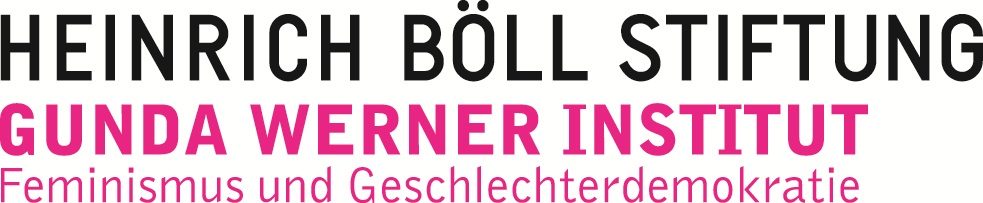

Ihr habt Feedback, Fragen, Ergänzungen oder wollt einen Workshop zu dem Thema anfragen?

Meldet Euch gerne unter&nbsp;&nbsp;<strong>feministclickback {a} mail36.net</strong>

<h2>Impressum</h2>

Tina Reis 
c/o Naturfreundejugend Berlin 
Weichselstraße 13 
12045 Berlin

feministclickback {a} mail36.net

V.i.S.d.P. Tina Reis Adresse siehe oben

<h2>Vielen Dank an:</h2>

<ul style="text-align: left;list-style: none;"><li>re:ny (Layout)</li>
    <li><a href="http://lpw.io">Laura Pierson Wadden</a> (Übersetzung und Webdesign)</li><li>
    Sonja Folsche, Charlie Kaufhold and Jan Tölva (Lektorat)</li></ul>

Mit freundlicher Unterstützung des Gunda-Werner-Institutes für Feminismus und Geschlechterdemokratie in der Heinrich-Böll-Stiftung

This work by <a xmlns:cc="http://creativecommons.org/ns#" href="https://feministclickback.org" property="cc:attributionName" rel="cc:attributionURL">feministclickback.org</a> is licensed under a <a rel="license" href="http://creativecommons.org/licenses/by-nc-sa/4.0/">Creative Commons Attribution-NonCommercial-ShareAlike 4.0 International License</a>.

<h2>Datenschutz</h2>

Um z.B. zu sehen, wie viele Nutzer*innen die Seite besuchen, nutzt diese Webseite Matomo (vormals PIWIK), ein Webanalyse-Tool. Der Einsatz des Tools entspricht der neuen Datenschutz-Grundverordnung. Es findet keine Übertragung der Daten an Dritte statt, indem Matomo auf einem eigenen Server gehostet wird, und alle IP-Adressen werden anonymisiert, sodass keine Rückschlüsse auf individuelle Nutzer*innen möglich sind. Du kannst der Datenerhebung jederzeit widersprechen, indem Du in Deinem Browser die Do-not-track-Einstellung aktivierst oder folgendes Opt-out anklickst (wenn Du die Do not Track-Funktion bereits aktiviert hast, wird Dir lediglich eine Information angezeigt:):

<iframe
        style="border: 0; height: 200px; width: 600px;"
        src="https://feministclickback.org/analytics/index.php?module=CoreAdminHome&action=optOut&language=en&backgroundColor=&fontColor=&fontSize=&fontFamily="></iframe>

